# 'Easy Hand' video conference support system

<!--프로젝트 대문 이미지-->

## ✋'손' 쉬운 화상 회의 지원 시스템

 

 

# 1. 🧭Research background and necessity

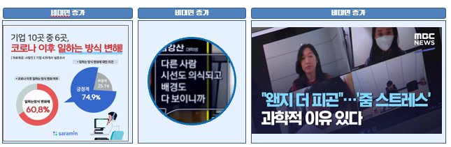

- 코로나19 이후 비대면 수업, 재택 근무, 비대면 회의의 급증

- 화상 회의에서 주변 환경과 사람의 노출로 사생활 침해 피로감 증가

- '줌 스트레스'라는 신조어 등장, 사생활 노출 문제 부각

### 📰참고기사

#### 코로나19 여파… 화상회의 서비스 '줌' 매출 급증 - https://www.bbc.com/korean/international-53981543

#### 웍스모바일 "코로나19 이후 화상 회의 최대 28배 증가" - https://www.yna.co.kr/view/AKR20200413067000017

### 🏴프로젝트 주제

#### 기능 복잡성 : '줌'의 가상 아바타, 가상 배경 화면 등 프라이버시 보호 기능은 찾기 어려움

#### 사용자 어려움 : 중장년층이나 학생들이 복잡한 기능을 파악하고 사용하는 데 어려움

#### 사생활 침해 : 화상 회의 중 사생활이 무방비하게 노출

#### 손 동작 제어 : 다양한 프라이버시 보호 기능을 간단한 손 동작만으로 실행할 수 있는 시스템 개발 필요

 

 

# 2. 🌝Project Team

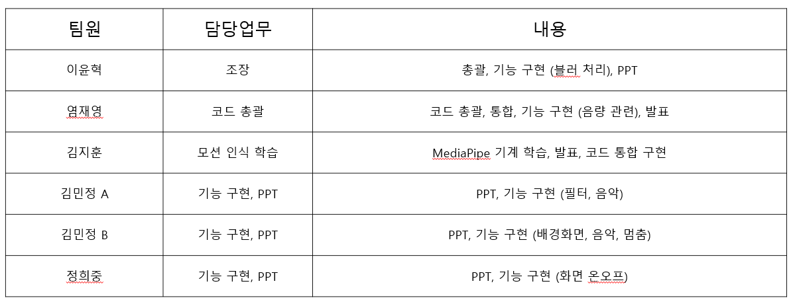

## 💹Gantt chart

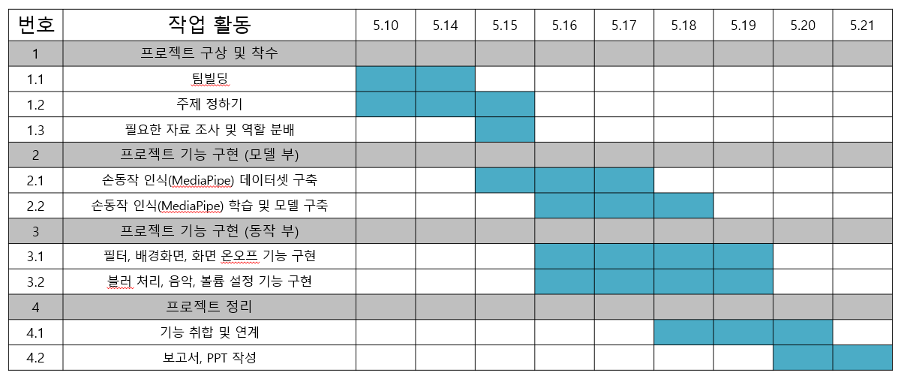

 

 

# 3. 📊Technologies Stack

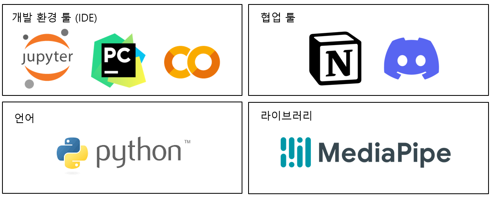

- [FLASK](https://flask.palletsprojects.com/en/3.0.x/)
- [AWS EC2](https://aws.amazon.com/ko/pm/ec2/?gclid=Cj0KCQjw2ou2BhCCARIsANAwM2Fvl1JEgLF-nt9pi6LoAAjTDbIZtSxlKan5_r2ELY6JUkk748ac8A0aAvxpEALw_wcB&trk=4c74fd91-5632-4f18-ac76-a6c66c92e185&sc_channel=ps&ef_id=Cj0KCQjw2ou2BhCCARIsANAwM2Fvl1JEgLF-nt9pi6LoAAjTDbIZtSxlKan5_r2ELY6JUkk748ac8A0aAvxpEALw_wcB:G:s&s_kwcid=AL!4422!3!477203497843!e!!g!!aws%20ec2!11549843702!111422708806) 
- [Android Studio](https://developer.android.com/studio?gad_source=1&gclid=Cj0KCQjw2ou2BhCCARIsANAwM2ElJwpX8AmXHdmDqeFXJeiNQMz6gyhSunPf7V0LzFr2tV11ZdIBClkaArGyEALw_wcB&gclsrc=aw.ds&hl=ko) 
- [Dlib](https://dlib.net/)

# 4. Project Process

## 📥데이터 셋 구축 

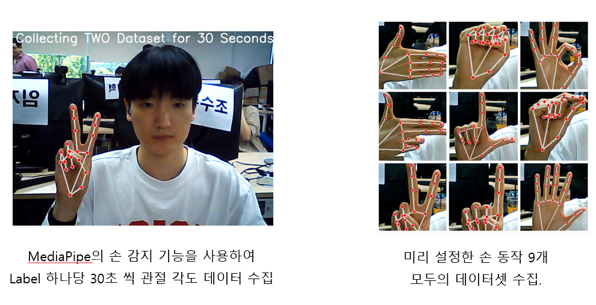

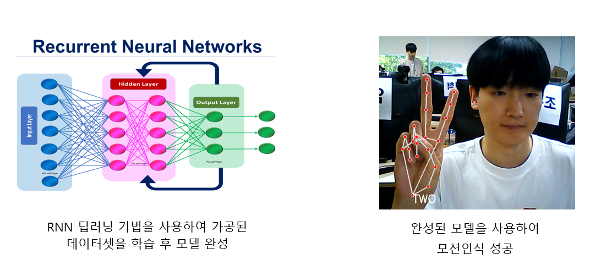

## 👋주요기능 구현

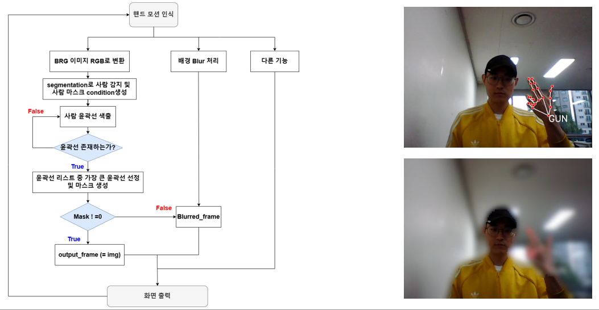

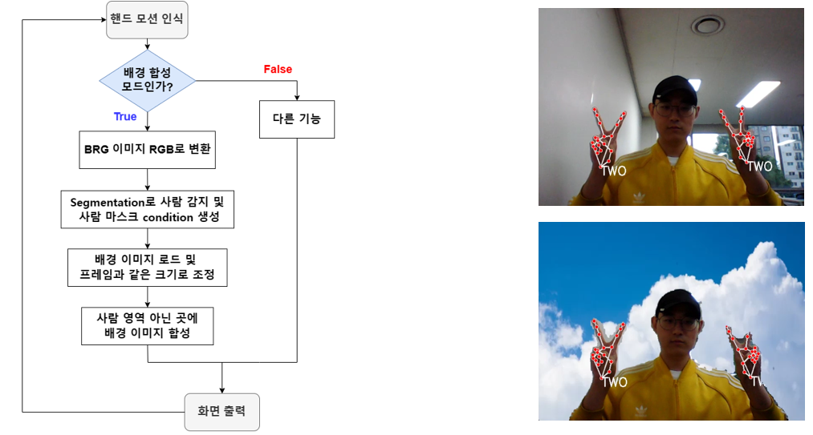

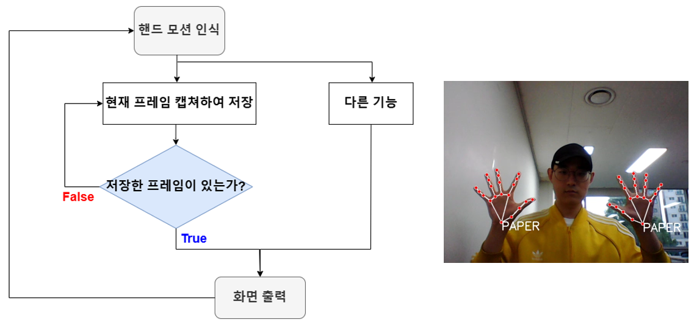

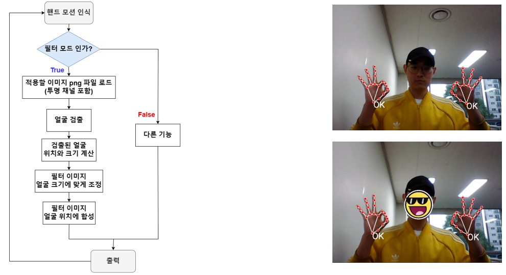

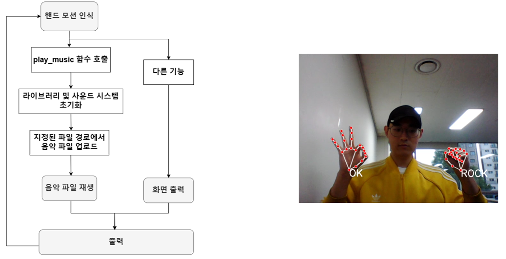

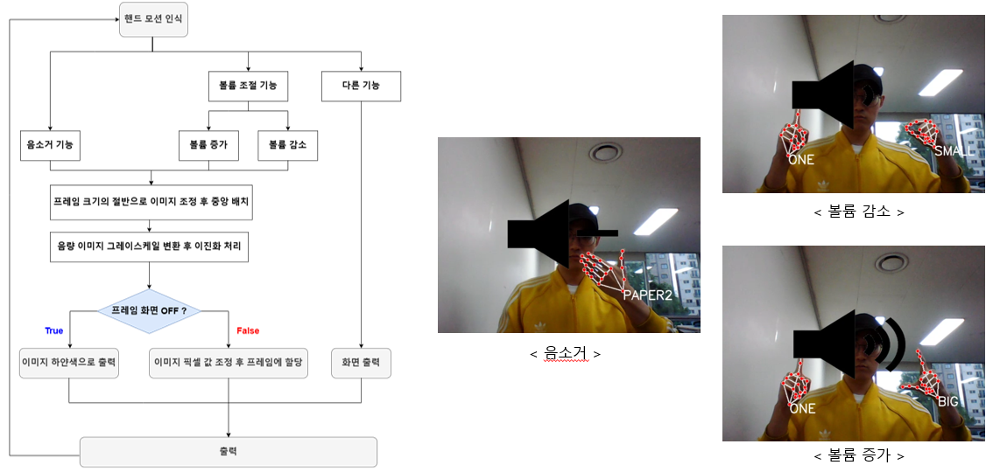

# 5. 자체 평가 의견

# Contact
- 📧 wodud6423@kau.kr

