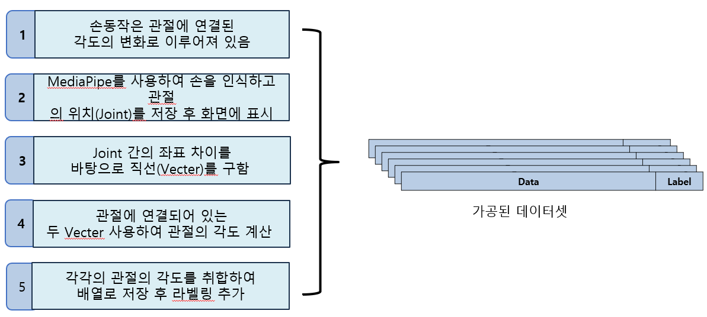
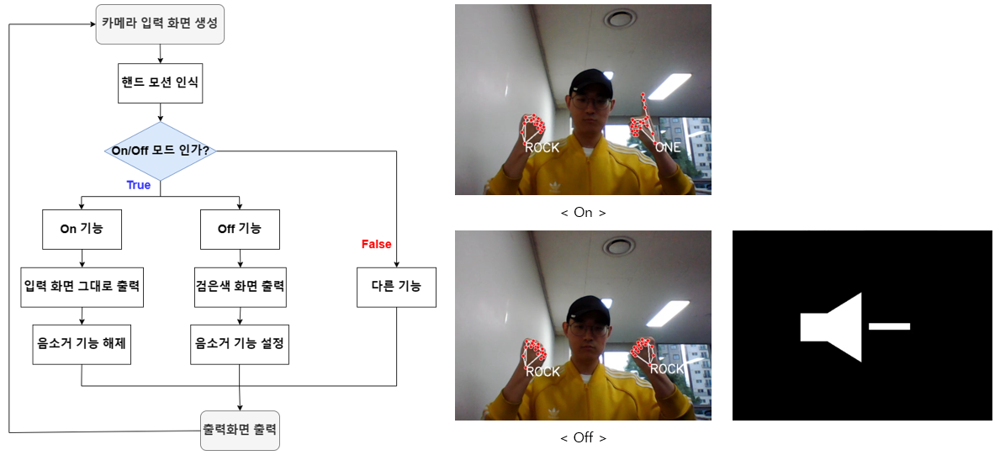
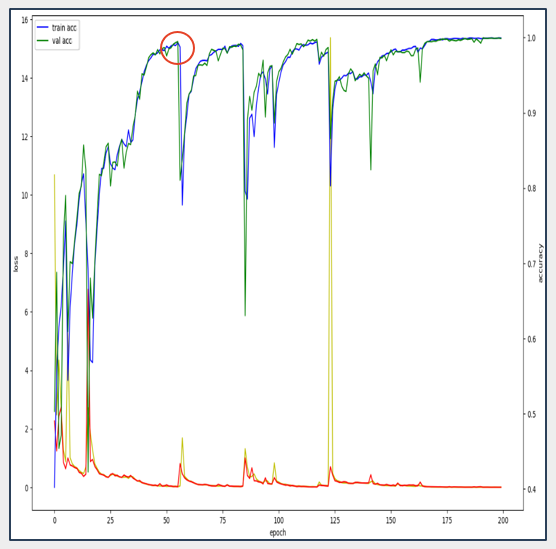

# 'Easy Hand' video conference support system

## ✋'손' 쉬운 화상 회의 지원 시스템

 

 

# 1. 🧭프로젝트 선정 배경및 시장조사

- 코로나19 이후 비대면 수업, 재택 근무, 비대면 회의의 급증

- 화상 회의에서 주변 환경과 사람의 노출로 사생활 침해 피로감 증가

- '줌 스트레스'라는 신조어 등장, 사생활 노출 문제 부각

### 📰참고기사

#### 코로나19 여파… 화상회의 서비스 '줌' 매출 급증 - https://www.bbc.com/korean/international-53981543

#### 웍스모바일 "코로나19 이후 화상 회의 최대 28배 증가" - https://www.yna.co.kr/view/AKR20200413067000017

### 🏴프로젝트 주제

#### 기능 복잡성 : '줌'의 가상 아바타, 가상 배경 화면 등 프라이버시 보호 기능은 찾기 어려움

#### 사용자 어려움 : 중장년층이나 학생들이 복잡한 기능을 파악하고 사용하는 데 어려움

#### 사생활 침해 : 화상 회의 중 사생활이 무방비하게 노출

#### 손 동작 제어 : 다양한 프라이버시 보호 기능을 간단한 손 동작만으로 실행할 수 있는 시스템 개발 필요

 

 

# 2. 🌝Project Team

## 💹Gantt chart

 

 

# 3. 📊Technologies Stack

- [FLASK](https://flask.palletsprojects.com/en/3.0.x/)
- [AWS EC2](https://aws.amazon.com/ko/pm/ec2/?gclid=Cj0KCQjw2ou2BhCCARIsANAwM2Fvl1JEgLF-nt9pi6LoAAjTDbIZtSxlKan5_r2ELY6JUkk748ac8A0aAvxpEALw_wcB&trk=4c74fd91-5632-4f18-ac76-a6c66c92e185&sc_channel=ps&ef_id=Cj0KCQjw2ou2BhCCARIsANAwM2Fvl1JEgLF-nt9pi6LoAAjTDbIZtSxlKan5_r2ELY6JUkk748ac8A0aAvxpEALw_wcB:G:s&s_kwcid=AL!4422!3!477203497843!e!!g!!aws%20ec2!11549843702!111422708806) 
- [Android Studio](https://developer.android.com/studio?gad_source=1&gclid=Cj0KCQjw2ou2BhCCARIsANAwM2ElJwpX8AmXHdmDqeFXJeiNQMz6gyhSunPf7V0LzFr2tV11ZdIBClkaArGyEALw_wcB&gclsrc=aw.ds&hl=ko) 
- [Dlib](https://dlib.net/)

# 4. 📐Project Process

## 📥데이터 셋 구축 

## 👋주요기능 구현

# 5. 👧자체 평가 의견

## 📈프로젝트 성능 평가 - 모델 성능 그래프(loss / epoch)

- 처음 몇 에포크 동안 손실값이 크게 변동하고, 정확도도 불안정하게 변하는 걸 볼 수 있다.

- 대략 50번째 에포크까지는 학습 정확도와 검증 정확도가 비슷하게 증가했다.

- 특정 에포크에서 손실이 갑자기 급증하고, 정확도도 급격히 떨어지는 현상이 관찰되는데, 모델이 특정 배치에서 이상값(outliers)을 만났거나, 학습률이 너무 높아 모델이 과적합된 것으로 추정한다.

## 📑프로젝트 자체 평가

## 🎇프로젝트 소감

- 이윤혁 : 이정도 인원으로 프로젝트를 진행한 것은 처음이었는데, 서로 소통해가면서 코드를 완성하는 것이 즐거웠다.
  
- 염재영 : 팀원들 간에 소통도 잘되고, 프로젝트 진행 과정에 어려움이 없어서 즐거웠던 것 같다.
  
- 김지훈 : 협업툴의 부족으로 효율적인 일처리가 안된 것은 아쉬웠지만 프로젝트 자체는 계획대로 잘 진행되어 만족스럽다.
  
- 김민정A : 강의를 정리할 수 있고, 새로운 기법도 배울 수 있는 시간이었다.

- 김민정B : 협업의 중요성을 배웠고, 강의 내용을 다시 한 번 정리할 수 있어서 너무나 값진 시간이었다.
  
- 정희중 : 기능을 만들기 전에 팀원들과 미리 협업하고 수시로 점검 받으면서, 서로 호환이 되도록 해야한다는 것을 느꼈다.

# Contact
- 📧 염재영 -  wodud6423@kau.kr

